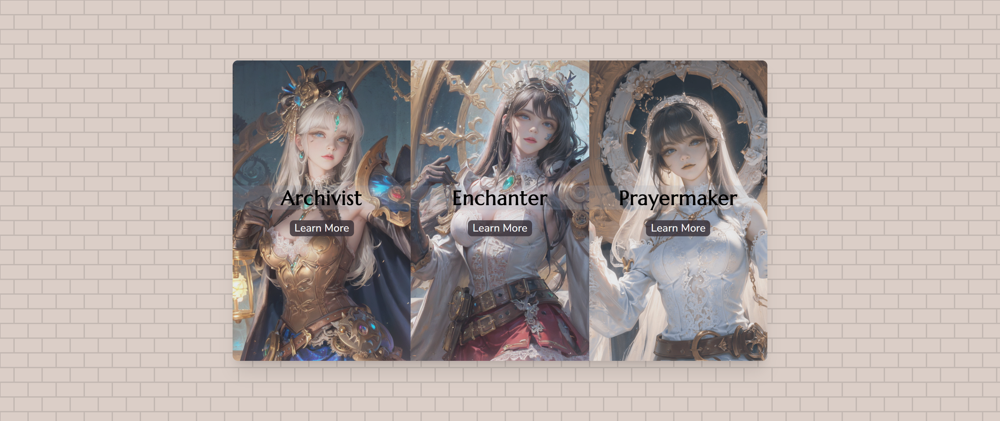

# Frontend Mentor - 3-column preview card component solution

This is a solution to the [3-column preview card component challenge on Frontend Mentor](https://www.frontendmentor.io/challenges/3column-preview-card-component-pH92eAR2-).

## Table of contents

- [Overview](#overview)
  - [The challenge](#the-challenge)
  - [Screenshot](#screenshot)
  - [Links](#links)
- [My process](#my-process)
  - [Built with](#built-with)
  - [What I learned](#what-i-learned)
  - [Continued development](#continued-development)
- [Author](#author)

## Overview

### The challenge

Users should be able to:

- View the optimal layout depending on their device's screen size
- See hover and focus states for interactive elements

### Screenshot

### Links

- Solution URL: [Solution](https://www.frontendmentor.io/solutions/order-summary-reacttailwindtypescript-aaxrIG5Y9R)
- Live Site URL: [Live](https://fmentor3columncard.netlify.app/)

## My process

This is my fourth Frontend Mentor challenge using React, TypeScript, and Tailwind. As usual, I started it running <code>npx create-react-app --template TypeScript </code>. For this challenge, I figured it was a perfect opportunity to work with modals to display the information. The concept was to resemble when you're picking a class or an advanced class in a game.

### Built with

- React.js
- Tailwind CSS
- TypeScript
- Mobile-First Approach

### What I learned

As usual, my experience with React, Tailwind, and TypeScript continue to increase with each project/challenge I tackle. I learned how to work with modals, broke it into components to gain extra practice, plus I learned how to work with background images in React.

### Continued development

Same as usual, I want to continue development on React, Tailwind, and TypeScript.

## Author

- Frontend Mentor - [@GenuineMiyashita](https://www.frontendmentor.io/profile/GenuineMiyashita)
