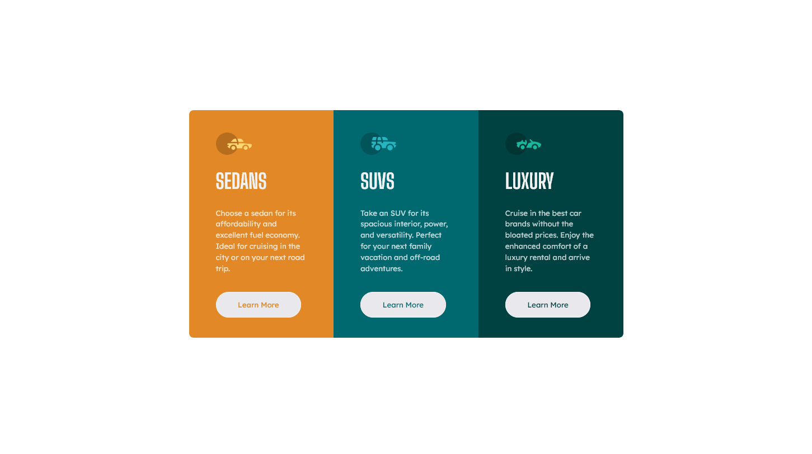

# Frontend Mentor - 3-column preview card component solution

This is a solution to the [3-column preview card component challenge on Frontend Mentor](https://www.frontendmentor.io/challenges/3column-preview-card-component-pH92eAR2-). Frontend Mentor challenges help you improve your coding skills by building realistic projects.

## Table of contents

- [Overview](#overview)
  - [The challenge](#the-challenge)
  - [Screenshot](#screenshot)
  - [Links](#links)
- [My process](#my-process)
  - [Built with](#built-with)
  - [What I learned](#what-i-learned)
  - [Continued development](#continued-development)
- [Author](#author)

## Overview

### The challenge

Users should be able to:

- View the optimal layout depending on their device's screen size
- See hover and focus states for interactive elements

### Screenshot

### Links

- Solution URL: (https://www.frontendmentor.io/solutions/3column-preview-card-component-1qpcc7fefM)
- Live Site URL: (https://genuinemiyashita.github.io/3-Column-Card-Component/)

## My process

As usual, I started with the semantic HTML5. Afterwards, I used the mobile-first approach by using FireFox's developer tools and the iPhone 11 pro as my screen size. I originally started with a bunch of Bootstrap syntax in the HTML, since I was determined to get practice with Bootstrap. However, I deleted everything besides the container tag because I wanted the CSS to be separated and I wanted more control over fine-tuning, which, Bootstrap wasn't allowing me or at least I'm not aware of how to fine-tune it at the moment.

### Built with

- Mobile-first workflow
- Semantic HTML5 markup
- CSS custom properties
- Flexbox
- Bootstrap

### What I learned

Although I deleted everything, I did get some practice in with Bootstrap and I sort of feel that I'll really just incorporate it for the containers and grid system down the road for full-blown sites. I understand that it has a bunch of quick on-hand CSS, but I enjoy the control by keeping the majority of styling in the CSS document. I also was able to get more hands on practice with flexbox.

### Continued development

As usual, the goal is to continue HTML, CSS, and JavaScript! Especially since I'm getting close to challenges that include JS. I've been working through the JavaScript sections in my Udemy course and through The Odin Project and have gained experience with functions, arrays, objects, loops, etc.

## Author

- Frontend Mentor - [@GenuineMiyashita](https://www.frontendmentor.io/profile/GenuineMiyashita)
