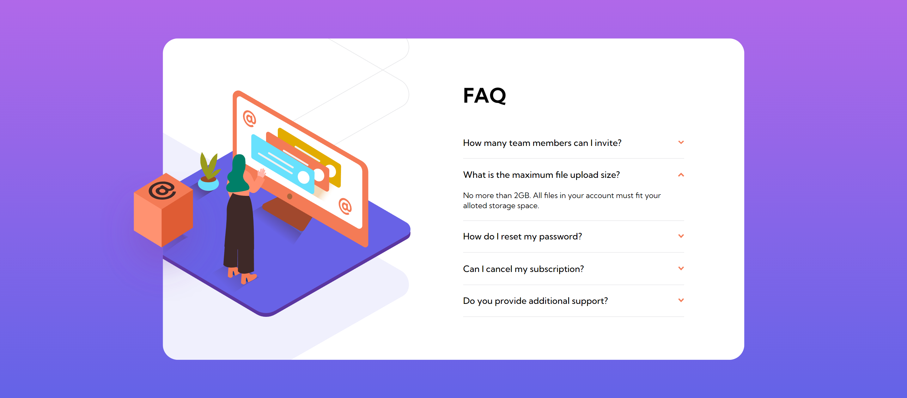
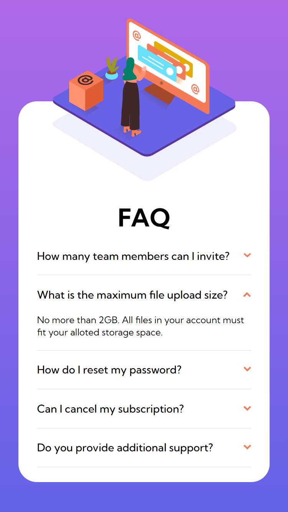

# Frontend Mentor - FAQ accordion card

## Table of contents

- [Overview](#overview)
  - [The challenge](#the-challenge)
  - [Screenshot](#screenshot)
  - [Links](#links)
- [My process](#my-process)
  - [Built with](#built-with)
  - [What I learned](#what-i-learned)
  - [Continued development](#continued-development)
- [Author](#author)

## Overview

### The challenge

Your users should be able to:

- View the optimal layout for the component depending on their device's screen size
- See hover states for all interactive elements on the page

### Screenshots

## Desktop

## Mobile

### Links

- Solution URL: [Solution](https://www.frontendmentor.io/solutions/faq-accordion-card-reacttypescripttailwind-HsqlOyqqH7)
- Live Site URL: [Live](https://fmentorfaqcard.netlify.app/)

## My process

This is the first challenge with React, TypeScript, and Tailwind CSS that isn't a re-design of a previous challenge and it it's the first challenge with my Frontend Mentor pro subscription, so this was my first chance to work with Figma files too. My process has changed and I've been using Milanote to help breakdown a projects to their elements and help visualize each element before I start to code and with the addition of Figma, that process has increased.

### Built with

- React.js
- Tailwind CSS
- TypeScript
- Mobile-First Approach

### What I learned

As mentioned, this is my first opportunity to work with Figma files and Figma in general. Part of the learning process was outside the project and messing around with the Figma desktop app and getting familiarity with it before I started the project. As for the actual project, this was my first experience with making an accordion card and opted for a simple one that utilizes .map() over my array of questions. However, it might of been better to just start with an accordion from material UI or bootstrap and edit it from there.

### Continued development

Same as usual, I want to continue development on React, Tailwind, and TypeScript. This project really helped me getting comfortable with Tailwind CSS and working with more custom boundaries instead of the pre-defined ones.

## Author

- Frontend Mentor - [@GenuineMiyashita](https://www.frontendmentor.io/profile/GenuineMiyashita)
