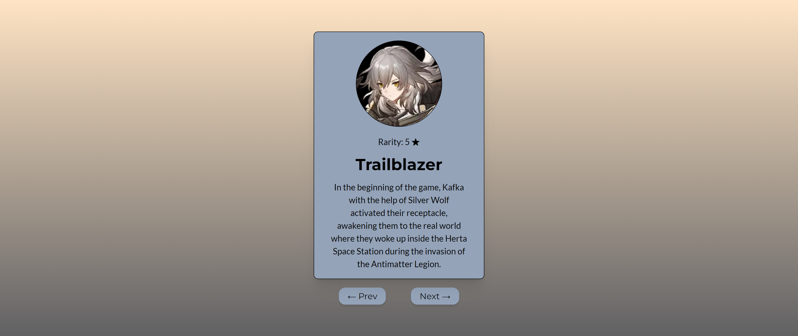

# Frontend Mentor - Product preview card component solution

This is a solution to the [QR code component challenge on Frontend Mentor](https://www.frontendmentor.io/challenges/qr-code-component-iux_sIO_H).

## Table of contents

- [Overview](#overview)
  - [The challenge](#the-challenge)
  - [Screenshot](#screenshot)
  - [Links](#links)
- [My process](#my-process)
  - [Built with](#built-with)
  - [What I learned](#what-i-learned)
  - [Continued development](#continued-development)
- [Author](#author)

## Overview

### The challenge

Users should be able to:

- View the optimal layout depending on their device's screen size
- See hover and focus states for interactive elements

### Screenshot

### Links

- Solution URL: [Solution](https://www.frontendmentor.io/solutions/qr-code-component-reacttailwindtypescript-qKy7p6hQHv)
- Live Site URL: [Live](https://fmentorqrcode.netlify.app/)

## My process

This is my second Frontend Mentor challenge using React, TypeScript, and Tailwind. As usual, I started it running <code>npx create-react-app --template TypeScript </code>. I ended up making another array, however, this time I added more characters (5) compared to the amount of products from the previous challenge (3). I struggled to incorporate a prev/next button on the first challenge, however, I spent additional time reading the documentation, Stack Overflow, and Reddit to eventually figured it out.

### Built with

- React.js
- Tailwind CSS
- TypeScript
- Mobile-First Approach

### What I learned

I continued to apply the concepts of React and gain additional experience writing functional components. The small victory in this project is as mentioned in the "my process" section, I solved the problem that I struggled with last challenge and managed to incorporate a button prev/next button. This was also the biggest gain for myself as I have a strong grasp on how to use useState and pass down information.

### Continued development

Of course, I still need to continue learning about useState, props, and eventually useEffect for API calls. Additionally, I need to keep using TypeScript in my projects as the errors that it throws has been great in learning it. Finally, I want to keep using Tailwind CSS, however, start messing with customizing the parameters.

## Author

- Frontend Mentor - [@GenuineMiyashita](https://www.frontendmentor.io/profile/GenuineMiyashita)
