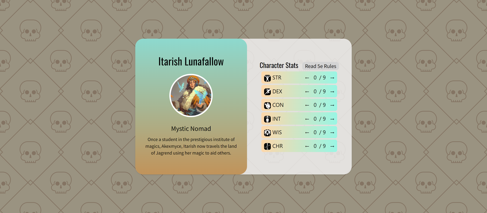

# Frontend Mentor - Results summary component solution

This is a solution to the [Results summary component challenge on Frontend Mentor](https://www.frontendmentor.io/challenges/results-summary-component-CE_K6s0maV).

## Table of contents

- [Overview](#overview)
  - [The challenge](#the-challenge)
  - [Screenshot](#screenshot)
  - [Links](#links)
- [My process](#my-process)
  - [Built with](#built-with)
  - [What I learned](#what-i-learned)
  - [Continued development](#continued-development)
- [Author](#author)

## Overview

### The challenge

Users should be able to:

- View the optimal layout depending on their device's screen size
- See hover and focus states for interactive elements

### Screenshot

### Links

- Solution URL: [Solution](https://www.frontendmentor.io/solutions/order-summary-reacttailwindtypescript-aaxrIG5Y9R)
- Live Site URL: [Live](https://fmentorresultssummary.netlify.app/)

## My process

This is my fifth Frontend Mentor challenge using React, TypeScript, and Tailwind. As usual, I started it running <code>npx create-react-app --template TypeScript </code>. For this challenge, I aimed to be a little more "complex" and start working with multiple components, usually, it's only a card component. This time, I added a button and a list component in preparation for harder challenges that work with multiple components.

### Built with

- React.js
- Tailwind CSS
- TypeScript
- Mobile-First Approach

### What I learned

As usual, my experience with React, Tailwind, and TypeScript continue to increase with each project/challenge I tackle. With this solution, I figured the list of different character attributes was a good opportunity to work with a list element and populate it through the .map(). It took me a while to sort out the individual buttons for each attribute and I still feel as if it could of been done better.

### Continued development

Same as usual, I want to continue development on React, Tailwind, and TypeScript. I'm going to start tackling larger challenges on Frontend that will provide more in-depth practice that you only experience with more complex projects.

## Author

- Frontend Mentor - [@GenuineMiyashita](https://www.frontendmentor.io/profile/GenuineMiyashita)
