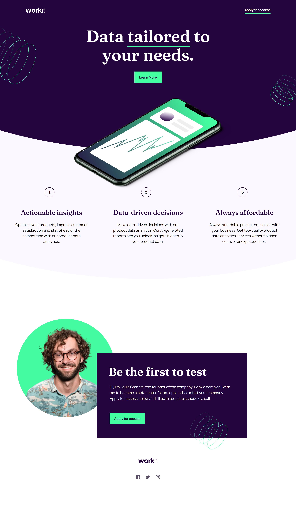

# Frontend Mentor - Workit landing page

## Table of contents

- [Overview](#overview)
  - [The challenge](#the-challenge)
  - [Screenshot](#screenshot)
  - [Links](#links)
- [My process](#my-process)
  - [Built with](#built-with)
  - [What I learned](#what-i-learned)
  - [Continued development](#continued-development)
- [Author](#author)

## Overview

### The challenge

Your challenge is to build out this landing page and get it looking as close to the design as possible.

You can use any tools you like to help you complete the challenge. So if you've got something you'd like to practice, feel free to give it a go.

Your users should be able to:

- View the optimal layout for the interface depending on their device's screen size
- See hover and focus states for all interactive elements on the page

### Screenshots

## Desktop

## Tablet

## Mobile

### Links

- Solution URL: [Solution](https://www.frontendmentor.io/solutions/results-summary-IGVogVjF2j)
- Live Site URL: [Live](https://fmentorresultssummary.netlify.app/)

## My process

This is my first premium challenge completed on Frontend Mentor and it's definitely an experience compared to free challenges. I still started with my mobile-first approach and used media queries to handle tablet and desktop screens, however, it required a lot more preparation on my end as it wasn't a simple singular card in the center of the screen compared to the recently challenges that I've completed.

### Built with

- React.js
- Tailwind CSS
- TypeScript
- Mobile-First Approach

### What I learned

Because this challenge required a mobile, tablet, and desktop view. I gained some valuable experience in media queries and the dev tools. I don't talk about the dev tools a lot even though I'm always using them, however, since this challenge was a lot more in-depth compared to previous challenges, I used the dev tools a lot more to double check if certain CSS was being applied/ignored in unintended ways. Additionally, I gained experience in setting up custom classes using Tailwind syntax to help reduce redundant Tailwind classes.

### Continued development

Same as usual, I want to continue development on React, Tailwind, and TypeScript. This was my first "larger" challenge completed and I thoroughly enjoyed it as I feel that I get to step away with a lot of good information in using React, Tailwind, and TypeScript. My only issue is that I want to start pushing myself to be more declarative in TypeScript, at the moment, it's mainly just a basic error guide. However, I want to start using interfaces, types, etc more.

## Author

- Frontend Mentor - [@GenuineMiyashita](https://www.frontendmentor.io/profile/GenuineMiyashita)
